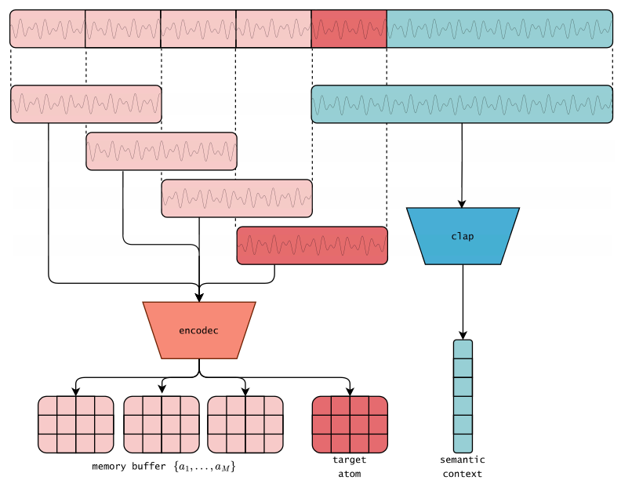
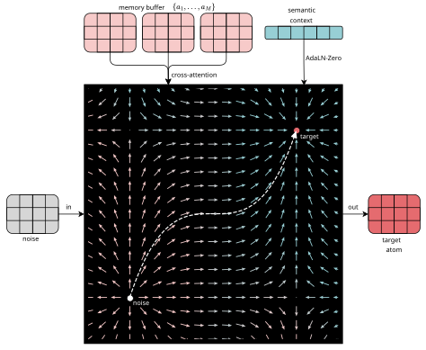

# SCAPES

**SCAPES** (Semantically Conditioned Auto-Regressive Prior for Environmental Sounds) is a generative audio framework for high-fidelity environmental texture synthesis with semantic control.

## Features

- **Semantic control** with CLAP-based conditioning (no manual labels)
- **Continuous latent generation** (no token quantization bottleneck)
- **Efficient training** on consumer GPUs
- **Long-term texture stability** in autoregressive generation
- **Smooth semantic interpolation** between environmental classes

## Demo

[](https://huggingface.co/spaces/cordutie/SCAPES-demo)

Try the online demo to generate environmental sounds with semantic control.

## Quick Start

### Simplified Tutorial

[](https://colab.research.google.com/github/cordutie/SCAPES/blob/main/quickstart/tutorial_simplified.ipynb) 

Train with default parameters and generate sounds quickly.


### Full Tutorial
[](https://colab.research.google.com/github/cordutie/SCAPES/blob/main/quickstart/tutorial_full.ipynb) 

Dive deep into the code and customize the training loop.

## Installation

```bash
# Create environment
python -m venv .venv
source .venv/bin/activate  # Linux/Mac
# .venv\Scripts\activate   # Windows

# Install dependencies
pip install --upgrade pip
pip install -r requirements.txt
```

> **Note**: You may need to install a CUDA-specific PyTorch build first depending on your setup.

## Pipeline

1. **Audio → Atoms**: Segment audio into overlapping windows and encode with EnCodec
2. **Semantic Context**: Precompute CLAP embeddings for conditioning

<p align="center">
  
</p>

3. **Flow Training**: Train conditional CNF (Flow Matching) to generate atoms from context
4. **Autoregressive Synthesis**: Generate atoms iteratively with overlap-and-add crossfade

<p align="center">
  
</p>

## Future Work

Potential areas for collaboration:

- **New Audio Codecs**: Explore alternatives to EnCodec
- **Perceptual Losses**: Train surrogate losses beyond MSE for latent comparison
- **Alternative Conditioning**: Experiment with features beyond CLAP

## Acknowledgments

This work has been supported by the project "IA y Música: Cá-tedra en Inteligencia Artificial y Música (TSI-100929-2023-1)", funded by the "Secretaría de Estado de Digitalización e Inteligencia Artificial and the Unión Europea-Next Generation EU". We also acknowledge support from NVIDIA Corporation and Meta through academic grant programs. Additionally, we would like to express our sincere gratitude to Daniela Quimis, Clara Charbonnier, Jan Pol Obrador, Marcel Manzano, Omar Hamze, Jordi Fabregat, Eduard Herrera, and Eric Mas, for their valuable insights into extending the model to diverse audio sources, exploring alternative training techniques, and helping shape the design of an intuitive demonstration of SCAPES.

## Citation

If you use SCAPES in your research, please cite:

```bibtex
@inproceedings{scapes,
  title     = {Semantically Conditioned Autoregresive Prior for Environmental Sounds},
  author    = {Esteban Gutiérrez and Lonce Wyse and Frederic Font and Xavier Serra},
  booktitle = {Proceedings of the International Conference on Digital Audio Effects (DAFx)},
  year      = {2026},
  address   = {Cambridge, USA}
}
```
